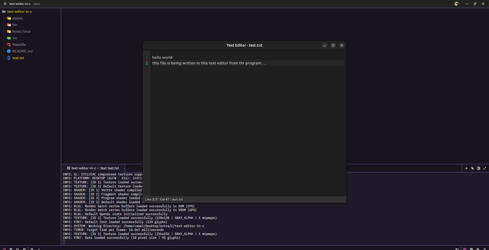

# Text Editor in C (Raylib)

A simple graphical text editor written in C using the raylib library. This project demonstrates how to build a basic text editor with a custom UI, real-time rendering, and keyboard input handling.

## 📸 Screenshot



## 🚀 Features

* Graphical user interface (window-based)
* Real-time text rendering
* Keyboard input handling
* Open and edit text files
* Save changes to file
* Cursor movement and basic editing
* Lightweight and fast

## 🛠️ Built With

* C Programming Language
* raylib (graphics & input handling library)

## 📦 Getting Started

### Prerequisites

* GCC or any C compiler
* raylib installed on your system

#### Install raylib (Linux example)

```bash
sudo apt install libraylib-dev
```

Or build from source: https://www.raylib.com/

## 🔧 Compilation

```bash
make build // for local build
make build-static // for portability
```

> Linking flags may vary depending on your OS.

## ▶️ Run the Editor

```bash
./bin/main // for local build
./build/linux/text // for static build
```

## 🎮 Controls

| Key        | Action                   |
| ---------- | ------------------------ |
| Arrow Keys | Move cursor              |
| Enter      | New line                 |
| Backspace  | Delete character         |
| Ctrl + S   | Save file                |
| Ctrl + Q   | Save file and Quit editor|
| Ctrl + Q   | Quit editor without saving|

> Controls depend on your implementation and may vary.

## 🖥️ How It Works

* Uses raylib to create a window and render text
* Handles keyboard input frame-by-frame
* Maintains a text buffer in memory
* Updates and redraws the screen continuously

## 📂 Project Structure

```
.
├── src/main.c      # Main source code
├── README.md       # Documentation
```

## 🧠 Learning Goals

This project helps you understand:

* Building GUIs in C without heavy frameworks
* Real-time rendering loops
* Keyboard input handling in graphical apps
* Text buffer management
* File I/O operations

## ⚠️ Limitations

* Single file editing only
* No syntax highlighting
* No undo/redo
* Basic UI design

## 🔮 Future Improvements idk

* Syntax highlighting
* Multiple file tabs
* Mouse support
* Scrollable viewport
* Font customization
* Undo/redo system
